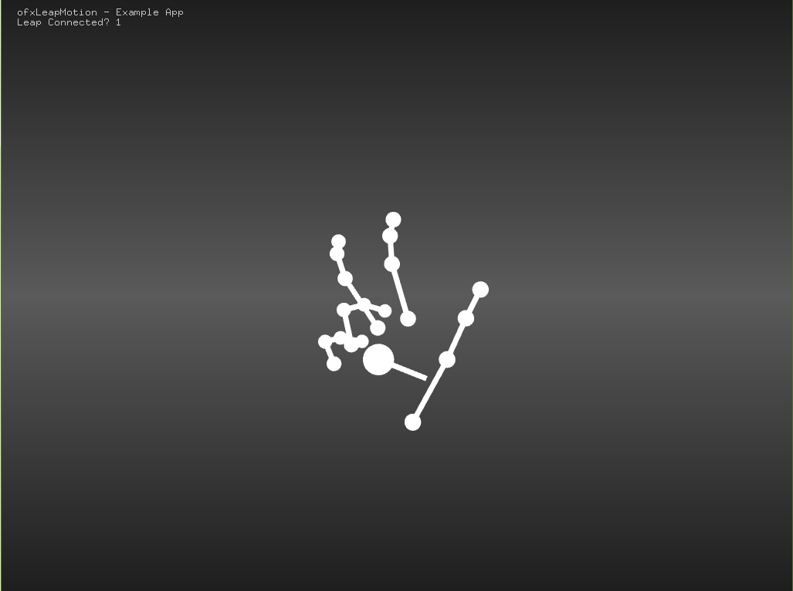

#Simulated Delayed Hand Reaction 
####A stroke victim advocate 
This is a program made to simulate what the disjunct and delay between the input (singnal from the brain) and the output (the movement of the limb) is like for stroke victims struggling with fine motor movment. 
This program is meant to empower those suffering with this affliction by enlightening others to thier daily struggle. It switches between realtime movement and the delay hand movement to show the slowed and 'normal' movement of the hand. 

